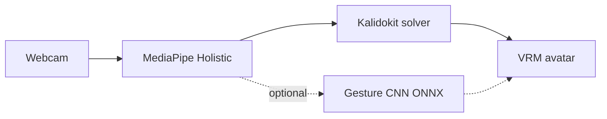

# Portfolio context — DL/CNN VTuber Demo

> UTS Deep Learning coursework · showcased at **TechFest 2026 AI Showcase**. Runnable app in `vtuber-demo/`. See [main README](README.md).

## What it is

Browser-based **VTuber-style motion capture**: webcam → **MediaPipe Holistic** landmarks → **Kalidokit** pose solving → **three.js + VRM** avatar driving. Optional **gesture CNN** classifier (ONNX) for hand gestures.

This is the project our team presented at **UTS TechFest 2026 AI Showcase** (nominated by Dr. Nabin Sharma).

## Course context

| Subject | Code | Relevance |
|---------|------|-----------|
| Deep Learning and Convolutional Neural Network | 42028 | Primary — real-time CV pipeline, gesture classification, browser inference |

## Team

| Member | Contribution |
|--------|--------------|
| Ko-Chun Liao | Project idea, working framework |
| Junjie Niu | Experiment design, technical support |
| Cheng-Yi (Louis) Li | Software development, productization, team coordination |

## My role

- Built the browser pipeline: tracking → motion solving → VRM retargeting
- Productization — turned experiments into something we could demo at TechFest with confidence
- Integrated MediaPipe Holistic, Kalidokit, and three-vrm with ESM/import maps
- Optional gesture CNN path: ONNX export and throttled browser classifier (see `vtuber-demo/docs/en/GESTURE_CNN.md`)
- Documentation hub (EN + zh-TW) and module-level README

## Pipeline

## What I learned

- CV pipelines fail quietly before models fail loudly — landmark stability and smoothing matter
- Browser inference constraints: throttling, CDN import maps, camera permissions
- Separating tracking, motion solving, and avatar driving keeps the pipeline debuggable
- Integration across teammates' components teaches more than any single notebook

## Limitations

- Requires localhost or HTTPS + webcam permission
- Gesture CNN is optional — Holistic + Kalidokit is the core demo
- Not a production VTuber tool; coursework / portfolio demo

## Related

- TechFest day-of post: see LinkedIn AI Showcase reflection (same project)
- Repo: https://github.com/louis-li-builds/dl-cnn-UTSproject51-vtuber-mediapipe-kalidokit
